# Caso 1 — Reconocimiento de dígitos MNIST en Android (TensorFlow Lite)

App Android que reconoce dígitos escritos a mano (0-9) **directamente en el dispositivo**, sin conexión a Internet, usando una CNN entrenada con MNIST y convertida a TensorFlow Lite (LiteRT).

<p align="center">
  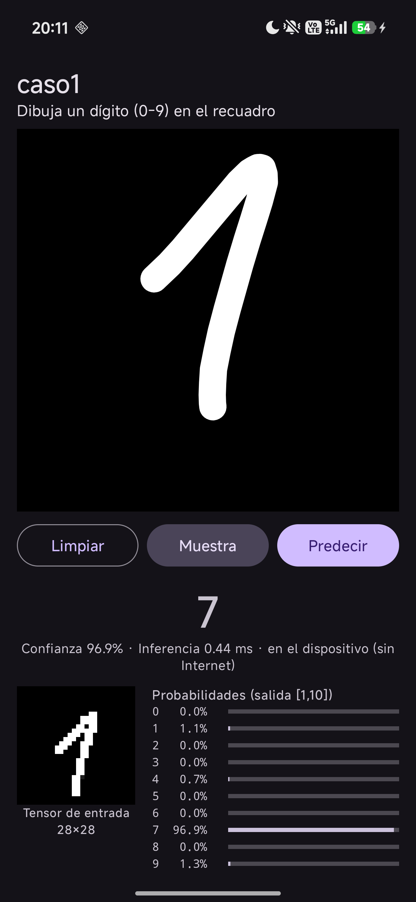
</p>

## Estructura

```
.
├── entrenamiento/        # Entrenamiento del modelo en Python
│   ├── train_mnist.py    # Dataset → CNN → TFLite → verificación → métricas
│   ├── requirements.txt
│   └── salida/           # Modelo .tflite/.keras, curvas, matriz de confusión, métricas
├── caso1/                # Proyecto Android (Kotlin)
│   └── app/src/main/
│       ├── java/com/grupo/caso1/
│       │   ├── MainActivity.kt      # UI, barras de probabilidad, muestras
│       │   ├── DrawView.kt          # Lienzo táctil negro con trazo blanco
│       │   └── DigitClassifier.kt   # Preprocesado MNIST + Interpreter TFLite
│       └── assets/                  # mnist.tflite y muestras reales de test
├── evidencias/           # Capturas de las pruebas en emulador y celular real
└── caso1.apk             # APK compilado listo para instalar
```

---

## Opción rápida: instalar el APK en el celular

1. Copia `caso1.apk` al celular (por cable USB, Drive, WhatsApp, etc.) o descárgalo desde este repositorio.
2. Abre el archivo desde el administrador de archivos del celular.
3. Si aparece el aviso **"Instalar apps desconocidas"**, entra a *Ajustes* y activa el permiso para la app desde la que abriste el APK (Archivos, Chrome, etc.).
4. Pulsa **Instalar** y luego **Abrir**.
5. Requiere **Android 7.0 (API 24) o superior**. No necesita Internet: puedes probarla en modo avión.

---

## Paso 1 — Entrenar el modelo (Python)

> Este paso es opcional: el modelo ya entrenado está incluido en `entrenamiento/salida/mnist.tflite` y en los `assets` de la app.

**Requisitos:** Python 3.10 – 3.12 (64 bits) y `pip`.

1. Entra a la carpeta de entrenamiento:
   ```bash
   cd entrenamiento
   ```
2. Crea y activa un entorno virtual:
   ```bash
   python -m venv venv
   # Windows
   venv\Scripts\activate
   # Linux / macOS
   source venv/bin/activate
   ```
3. Instala las dependencias:
   ```bash
   pip install -r requirements.txt
   ```
4. Ejecuta el entrenamiento (el dataset MNIST se descarga solo la primera vez):
   ```bash
   python train_mnist.py
   ```
5. Al terminar (≈ 1 minuto) se generan en `entrenamiento/salida/`:

   | Archivo | Contenido |
   |---|---|
   | `mnist.tflite` | Modelo cuantizado para Android (≈ 228 KB) |
   | `mnist.keras` | Modelo Keras completo |
   | `metricas.json` | Accuracy, tiempos, tamaños e historial por época |
   | `curvas.png` | Accuracy y loss por época |
   | `matriz_confusion.png` | Matriz de confusión sobre test |
   | `muestras.png` | Ejemplos del dataset |
   | `muestra_0/3/7.png` | Imágenes reales de test para probar la app |

### Qué hace el script

- Normaliza las imágenes 28×28 a `[0,1]`.
- Aplica aumento de datos leve (rotación, zoom, traslación) para tolerar dígitos dibujados en el celular.
- CNN: Conv(32) → Pool → Conv(64) → Pool → Dropout(0.3) → Dense(128) → Dense(10, softmax).
- 8 épocas, batch 128, semilla 42.
- Convierte a TFLite con cuantización de rango dinámico (pesos int8) y verifica el `.tflite` con el intérprete.

### Resultados

| Métrica | Valor |
|---|---|
| Accuracy Keras (test) | 98.94 % |
| Accuracy TFLite (test) | 98.94 % |
| Parámetros | 225 034 |
| Tamaño .keras → .tflite | 2676 KB → 228 KB |
| Entrada / salida | `[1,28,28,1]` float32 / `[1,10]` |

<p align="center">
  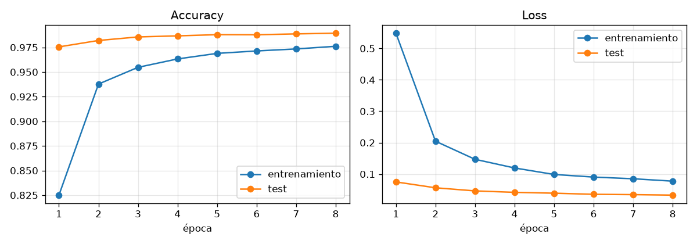<br>
  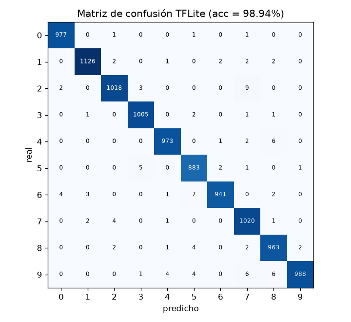
</p>

---

## Paso 2 — Usar un modelo nuevo en la app

Si volviste a entrenar, copia los archivos generados a los `assets` de la app:

```bash
# desde la raíz del repositorio
cp entrenamiento/salida/mnist.tflite   caso1/app/src/main/assets/
cp entrenamiento/salida/muestra_*.png  caso1/app/src/main/assets/
```

En Windows (PowerShell):

```powershell
Copy-Item entrenamiento\salida\mnist.tflite  caso1\app\src\main\assets\
Copy-Item entrenamiento\salida\muestra_*.png caso1\app\src\main\assets\
```

---

## Paso 3 — Compilar la app Android

**Requisitos:** Android Studio (reciente) con Android SDK 36 y JDK 11 o superior.

### Con Android Studio

1. *File → Open* y selecciona la carpeta **`caso1/`** (no la raíz del repo).
2. Espera a que termine el *Gradle Sync* (descarga las dependencias la primera vez).
3. Conecta un celular con **Depuración USB** activada o crea un emulador en *Device Manager*.
4. Pulsa **Run ▶**.

### Desde la terminal

```bash
cd caso1
./gradlew assembleDebug        # Windows: gradlew.bat assembleDebug
```

El APK queda en `caso1/app/build/outputs/apk/debug/app-debug.apk`. Para instalarlo con un celular conectado:

```bash
adb install -r app/build/outputs/apk/debug/app-debug.apk
```

> Si Gradle no encuentra el SDK, crea `caso1/local.properties` con la línea
> `sdk.dir=C\:\\Users\\<usuario>\\AppData\\Local\\Android\\Sdk` (ajusta la ruta).

---

## Paso 4 — Usar la app

1. **Dibuja** un dígito del 0 al 9 en el recuadro negro. Al levantar el dedo la app predice automáticamente.
2. Lee el resultado:
   - **Dígito grande:** la predicción del modelo.
   - **Confianza e inferencia:** probabilidad de la clase elegida y tiempo que tardó el modelo (en ms), calculado en el propio dispositivo.
   - **Tensor de entrada 28×28:** la imagen exacta que recibe el modelo después del preprocesado.
   - **Probabilidades:** una barra por cada dígito (salida `[1,10]` del modelo).
3. Botones:
   - **Predecir:** vuelve a clasificar lo que hay en el lienzo.
   - **Limpiar:** borra el dibujo y los resultados.
   - **Muestra:** carga una imagen real del set de test de MNIST (3, 7 y 0, en rotación) para comparar con los resultados de Python.

**Consejos:** dibuja el dígito grande y centrado con un trazo continuo. Si se confunde, pulsa *Limpiar* y vuelve a intentarlo.

### Cómo funciona por dentro

1. `DrawView` guarda el dibujo como bitmap (fondo negro y trazo blanco, igual que MNIST).
2. `DigitClassifier` recorta el dígito, lo escala a 20×20, lo centra en 28×28 por centro de masa y lo normaliza a `[0,1]`.
3. `Interpreter.run` (LiteRT) devuelve 10 probabilidades y se elige la mayor.
4. El manifiesto no pide permiso `INTERNET`: la inferencia es 100 % local.

---

## Evidencias

| Siete dibujado | Dos dibujado | Muestra MNIST | Modo avión |
|---|---|---|---|
|  |  | 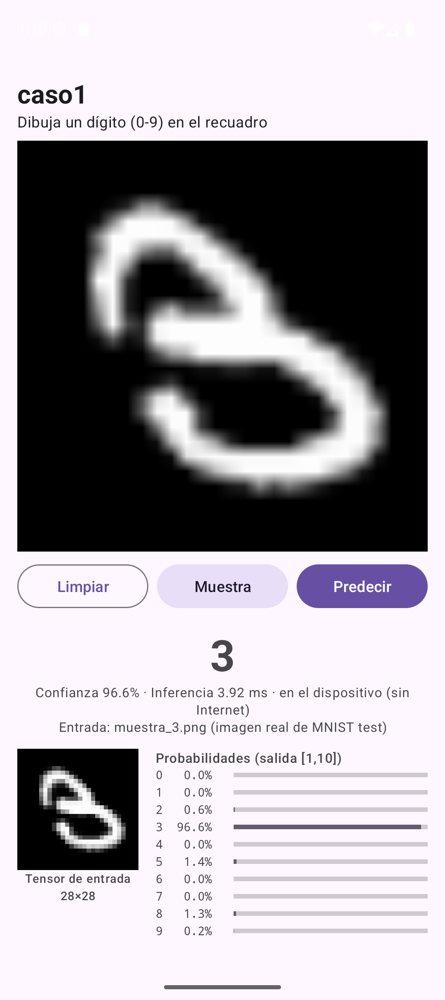 |  |

Reconocimiento de los 10 dígitos:

| 0 | 1 | 2 | 3 | 4 |
|---|---|---|---|---|
| 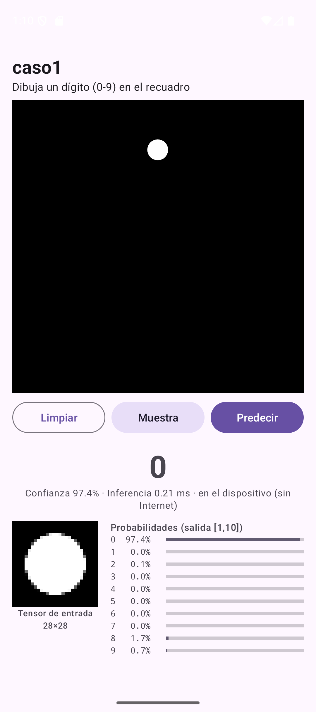 | 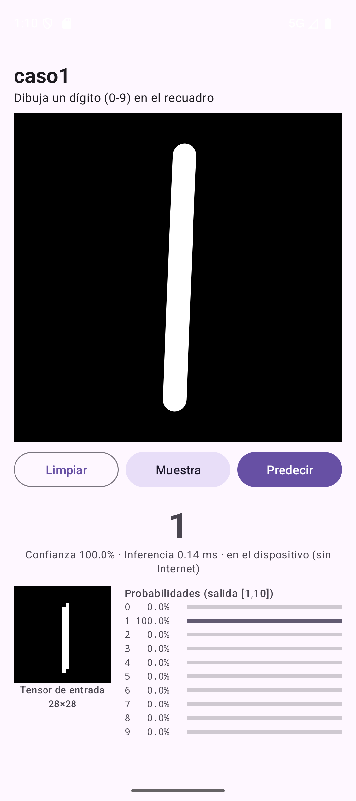 | 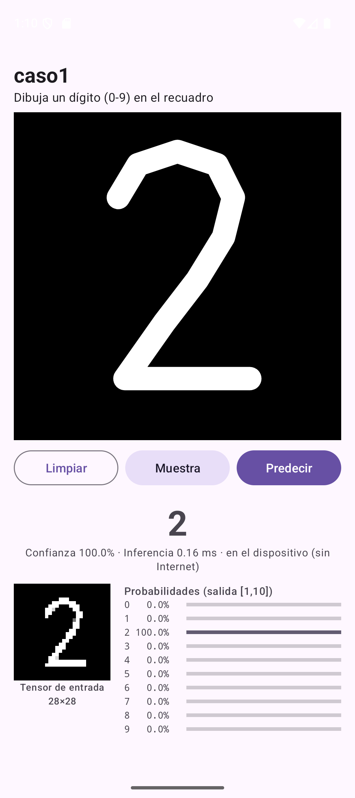 | 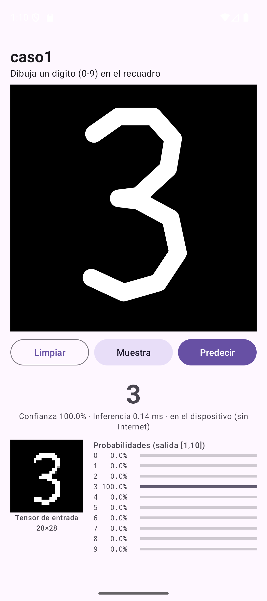 | 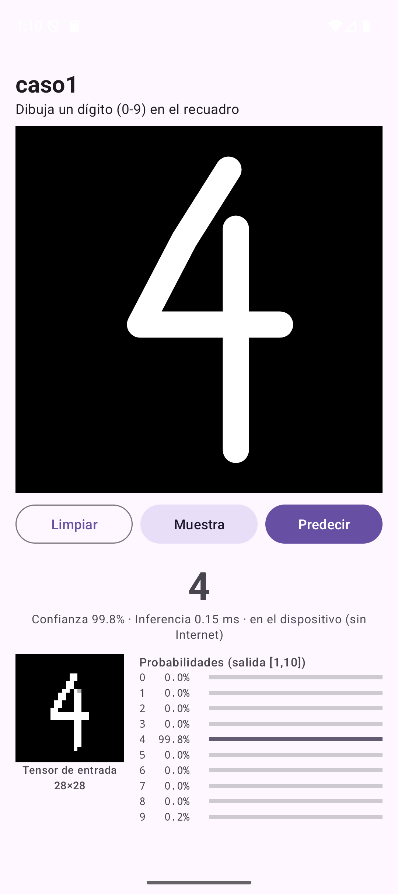 |
| **5** | **6** | **7** | **8** | **9** |
| 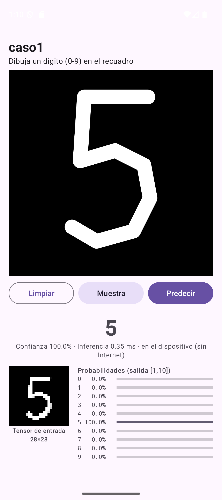 | 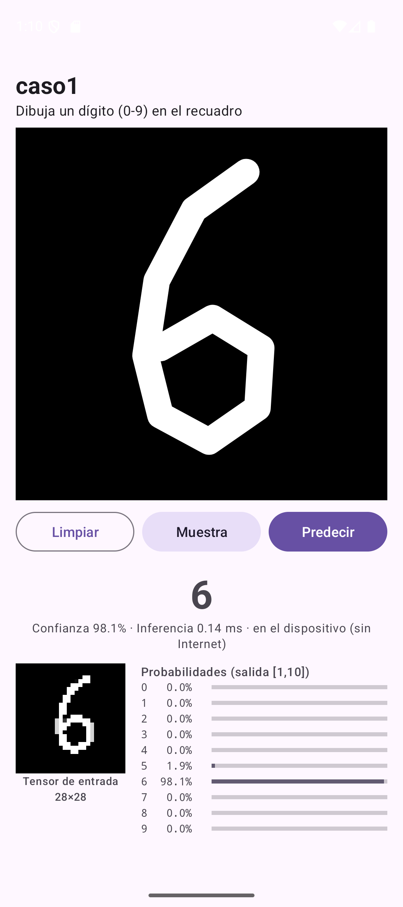 | 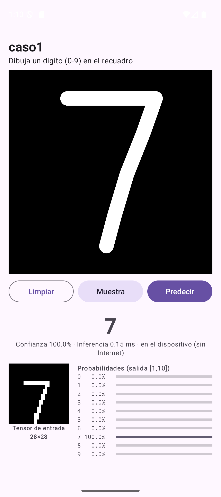 | 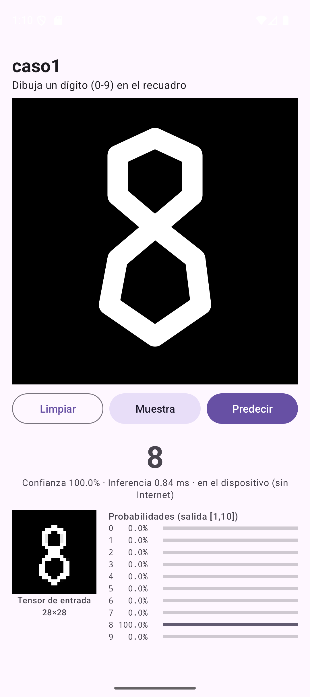 | 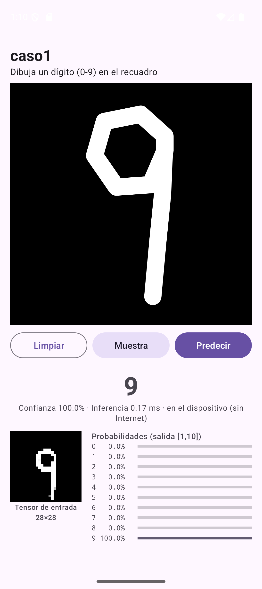 |

Todas las capturas están también comprimidas en `evidencias/capturas.rar`.
